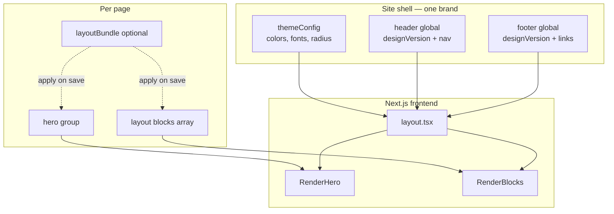

# 01 — Overview

## Goals

1. **Non-technical editors** build and maintain Orisa-style pages in Payload admin.
2. **Drag-and-drop blocks** for all page content between hero and footer.
3. **Layout bundles** as one-click homepage starters (Creative Agency, Marketing Agency, …).
4. **One brand → one header, one footer** — site-wide globals, not per-page overrides.
5. **No jQuery/Bootstrap** in the Next.js app — React + Tailwind + shadcn + GSAP where needed.

## Non-goals (initial phases)

- Per-page header/footer style overrides
- All 15 Orisa homepage demos in v1
- Shop (cart, checkout) pages
- All 8+ portfolio slideshow variants
- Importing Orisa HTML/JS as-is

## Principles

| Principle | Rationale |
|-----------|-----------|
| **Shell vs content separation** | Header/footer/globals = brand chrome; bundles = page recipes |
| **Reuse before rebuild** | Map Orisa sections to existing Payblocks blocks where styling can match |
| **Variant over duplicate** | Use `designVersion` on blocks/heroes instead of copy-paste blocks |
| **Server-first** | RSC for markup; `'use client'` only for GSAP, carousels, cursor |
| **Seed-driven demos** | `pnpm seed:orisa-*` scripts create bundles + optional globals |
| **Reduced motion** | All scroll/GSAP effects respect `prefers-reduced-motion` |

## Orisa source inventory

| Category | Count | HTML examples |
|----------|-------|---------------|
| Homepage demos | 15 (+ dark variants) | `index.html` … `index-15.html` |
| About | 3 | `about-1.html` … `about-3.html` |
| Services | 4 | `services-1.html`, `services-details.html` |
| Portfolio | 18+ | `portfolio-cinema.html`, `portfolio-details-1.html`, … |
| Blog | 5 | `archive-1.html`, `blog-details.html` |
| Contact | 2 | `contact-1.html`, `contact-2.html` |
| Other | 4 | `team.html`, `pricing.html`, `faqs.html`, `404.html` |

Dark variants share the same layout as light — handle via `themeConfig` + site dark mode, not separate bundles.

## Editor workflow

### One-time site setup (admin)

```
Globals → ThemeConfig     Set Orisa colors, fonts, radius
Globals → Header          Pick Orisa navbar style, logo, nav links, CTA
Globals → Footer          Pick Orisa footer style, columns, social links
```

### Create or refresh a page

```
Pages → New / Edit page
  Hero tab                (filled by bundle or edited manually)
  Page sections tab       Drag blocks, edit content
  Sidebar → Layout bundle Pick "Orisa — Creative Agency"
  Apply mode              "Replace hero + page sections"
  Save                    Bundle content imported; header/footer unchanged
```

### Day-to-day editing

- Reorder sections via drag-and-drop
- Expand any block to edit text, images, links
- Add/remove blocks from the block library
- Publish; use live preview

## Architecture diagram



## Layout bundle vs theme preset

| Concept | What it stores | Where | Changes when editor… |
|---------|----------------|-------|----------------------|
| **Layout bundle** | Hero + ordered blocks | `layout-bundles` collection | Applies bundle on a page |
| **Site theme** | Colors, fonts | `themeConfig` global | Updates ThemeConfig |
| **Header style** | Navbar design + content | `header` global | Updates Header global |
| **Footer style** | Footer design + content | `footer` global | Updates Footer global |

A future **Theme Preset** (optional) could apply header + footer + themeConfig in one click via seed — but bundles remain content-only.

## Success criteria

- [ ] Editor creates homepage from Creative Agency bundle in &lt; 5 minutes
- [ ] Header/footer consistent across all pages
- [ ] Switching layout bundle does not change header/footer
- [ ] Visual parity with [Orisa Creative Agency demo](https://orisa-html-demo.pages.dev/) ≥ 85% on desktop
- [ ] Lighthouse performance ≥ existing Payblocks corporate homepage
- [ ] `prefers-reduced-motion` disables scroll-pin and cursor effects

## Licensing

Orisa is a ThemeForest HTML license — one end product. Using it as design source for a Payblocks client site is typically allowed; redistributing Orisa as a template product is not. Confirm license terms before shipping.
