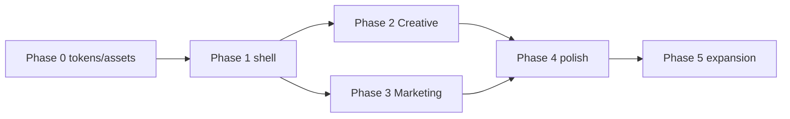

# 03 — Implementation phases

Phased delivery with tasks, estimates, and acceptance criteria. Implement in order; each phase should be mergeable and demoable.

**Legend:** `[P]` Payload/CMS · `[F]` Frontend · `[I]` Infrastructure · `[D]` Design asset · `[S]` Seed script

**Estimate:** 1 developer, ~6–10 weeks for Phases 0–2 (Creative + Marketing bundles + shell).

---

## Phase 0 — Prerequisites

| # | Task | Owner | Notes |
|---|------|-------|-------|
| 0.1 | Approve Orisa plan docs | Team | This folder |
| 0.2 | Confirm license (ThemeForest, one end product) | Legal/PM | |
| 0.3 | Extract Orisa design tokens from `main.css` | Design/Dev | ✅ `docs/orisa/design-tokens.json` |
| 0.4 | Screenshot demos for admin previews | Design | Deferred to Phase 1 (navbar/footer previews) |
| 0.5 | **Automated asset sync script** | Dev | ✅ `scripts/orisa/sync-assets.ts` |
| 0.6 | Run sync → commit `public/seed/orisa/` + manifest | Dev | ✅ 100 files, 0 missing |
| 0.7 | Verify manifest counts (~61 creative, ~53 marketing) | Dev | ✅ 48 creative-only + 40 marketing-only + 12 shared |

**Exit criteria:** Token one-pager + preview JPEGs + `pnpm orisa:sync-assets` produces seed folder + `asset-manifest.json`.

### Phase 0.5 — Asset sync script (no manual copy)

**Problem:** Orisa theme has ~764 images (~107MB). Editors need demo media in Payload, but nobody should hand-pick files.

**Solution:** `scripts/orisa/sync-assets.ts` reads the theme HTML and copies **only referenced assets**, bucketed by bundle:

| Bucket | Source HTML | Approx. files |
|--------|-------------|---------------|
| `shared/` | Used by both demos | ~12 |
| `creative/` | `index.html` only | ~49 |
| `marketing/` | `index-3.html` only | ~41 |

**How bundle assignment works (automatic):**

1. Parse `index.html` → set **Creative** asset paths (`src`, `href`, `data-background`, inline CSS urls)
2. Parse `index-3.html` → set **Marketing** asset paths
3. Intersection → **shared**; remainder → bundle-specific folders
4. Copy files from `ORISA_THEME_PATH/1.Orisa_HTML_template/{path}` → `public/seed/orisa/{shared|creative|marketing}/`
5. Write `scripts/orisa/asset-manifest.json` for seed scripts to import

**Usage:**

```bash
# Default theme path (override with env var)
export ORISA_THEME_PATH="/Users/admin/Documents/Theme/Orisa_v4.1.0_Unzip-First"

pnpm orisa:sync-assets
# → public/seed/orisa/shared/
# → public/seed/orisa/creative/
# → public/seed/orisa/marketing/
# → scripts/orisa/asset-manifest.json
```

**Acceptance:** Script is idempotent; re-run updates manifest; missing source files log warnings; no manual asset selection required.

---

## Phase 1 — Site shell (est. 1.5–2 weeks)

Goal: One Orisa brand — header, footer, theme tokens — independent of page content.

### 1.1 Orisa theme tokens `[P][F]`

| # | Task | Files |
|---|------|-------|
| 1.1.1 | Document token values | `docs/orisa/02-section-specs.md` |
| 1.1.2 | Add Orisa preset to seed globals | `scripts/seed-orisa-globals.ts` |
| 1.1.3 | Load Orisa fonts via `next/font` | `src/app/(frontend)/[[...slugs]]/layout.tsx` |
| 1.1.4 | Verify CSS variables in ThemeConfig component | `src/globals/ThemeConfig/Component.tsx` |

**Acceptance:** Running seed with `--globals` applies Orisa primary colors and fonts.

### 1.2 Header `navbar6` `[P][F]`

| # | Task | Files |
|---|------|-------|
| 1.2.1 | Implement Orisa navbar (desktop megamenu) | `src/globals/Header/navbar/navbar6.tsx` |
| 1.2.2 | Mobile Sheet / offcanvas | Same file or `Component.client.tsx` |
| 1.2.3 | Register `designVersion: '6'` | `src/globals/Header/config.ts`, `Component.tsx` |
| 1.2.4 | Add preview image | `public/admin/previews/header/navbar6.jpeg` |
| 1.2.5 | Optional: search overlay | Header client component |

**Acceptance:** Header renders on all pages; megamenu works desktop + mobile; live preview updates.

### 1.3 Footer `footer9` `[P][F]`

| # | Task | Files |
|---|------|-------|
| 1.3.1 | Implement Orisa dark footer | `src/globals/Footer/footer/footer9.tsx` |
| 1.3.2 | Service tags marquee (client) | `footer9.client.tsx` if needed |
| 1.3.3 | Register `designVersion: '9'` | `src/globals/Footer/config.ts`, `Component.tsx` |
| 1.3.4 | Add preview image | `public/admin/previews/footer/footer9.jpeg` |

**Acceptance:** Footer renders site-wide; nav columns + social editable in admin.

### 1.4 Layout bundle category `[P]`

| # | Task | Files |
|---|------|-------|
| 1.4.1 | Add `orisa` to LayoutBundles category options | `src/collections/LayoutBundles/index.ts` |
| 1.4.2 | Optional: visual preview on bundle `previewImage` | Already supported |

**Acceptance:** Orisa bundles filterable by category in admin.

**Phase 1 exit criteria:** Site renders with Orisa header + footer + colors on any page; layout field can remain empty.

---

## Phase 2 — Creative Agency bundle (est. 2.5–3.5 weeks)

Goal: Full [Creative Agency demo](https://orisa-html-demo.pages.dev/) as a layout bundle.

### 2.1 Hero `ORISA_CREATIVE_01` `[P][F]`

| # | Task | Files |
|---|------|-------|
| 2.1.1 | Add hero fields (headline lines, badge, bg image, floating tags) | `src/heros/config.ts` |
| 2.1.2 | Register in metadata + preview | `src/heros/metadata.ts` |
| 2.1.3 | Implement component | `src/heros/PageHero/heroOrisaCreative01.tsx` |
| 2.1.4 | Register in RenderHero | `src/heros/RenderHero.tsx` |

**Acceptance:** Editor selects ORISA_CREATIVE_01; hero matches demo structure.

### 2.2 New block: `orisaServicesPin` `[P][F]`

| # | Task | Files |
|---|------|-------|
| 2.2.1 | Block config (services array, headline, CTA) | `src/blocks/OrisaServicesPin/config.ts` |
| 2.2.2 | GSAP ScrollTrigger pin panels | `Component.client.tsx` |
| 2.2.3 | Register in pageBlocks + blockLoaders + RenderBlocks | |
| 2.2.4 | Reduced-motion fallback (stacked layout) | |

**Acceptance:** Scroll pin works desktop; static stack on reduced motion.

### 2.3 Extend existing blocks `[P][F]`

| Block | Variant | Priority |
|-------|---------|----------|
| `about` | orisa-1 | P1 |
| `logos` / `credibilityStrip` | orisa-marquee | P1 |
| `casestudies` | orisa-grid | P1 |
| `testimonial` | orisa-slider | P1 |
| `teamGallery` | orisa-grid (may reuse existing grid) | P1 |
| `closingCta` | orisa-1 | P1 |
| `faq`, `blog` | reuse defaults | P2 |

### 2.4 Seed Creative Agency `[S]`

| # | Task | Files |
|---|------|-------|
| 2.4.1 | Create seed script | `scripts/seed-orisa-creative-agency.ts` |
| 2.4.2 | Add npm script | `package.json` → `seed:orisa-creative-agency` |
| 2.4.3 | Create layout bundle + home page | slug: `orisa-creative-agency`, page slug: `home` or `orisa` |
| 2.4.4 | Wire globals via `--globals` | extends `seed-orisa-globals.ts` |

**Acceptance:**

```bash
pnpm seed:orisa-creative-agency
pnpm seed:orisa-creative-agency:globals  # or SEED_UPDATE_GLOBALS=1
pnpm dev
```

Editor opens home page → sees full Creative Agency content; header/footer from globals.

**Phase 2 exit criteria:** Creative Agency bundle demoable end-to-end.

---

## Phase 3 — Marketing Agency bundle (est. 2–3 weeks)

Goal: `index-3.html` as second layout bundle; validates shared block reuse.

### 3.1 Hero `ORISA_MARKETING_01` `[P][F]`

| # | Task | Files |
|---|------|-------|
| 3.1.1 | Hero fields (grid bg, testimonial card, headline) | `src/heros/config.ts` |
| 3.1.2 | Implement `heroOrisaMarketing01.tsx` | |
| 3.1.3 | Preview + metadata | |

### 3.2 New block: `orisaScrollServices` `[P][F]`

| # | Task | Files |
|---|------|-------|
| 3.2.1 | Side nav + scroll-pinned content panels | `src/blocks/OrisaScrollServices/` |
| 3.2.2 | GSAP ScrollTrigger | `Component.client.tsx` |
| 3.2.3 | Register + reduced-motion fallback | |

### 3.3 Extend blocks for Marketing sections `[P][F]`

| Block | Notes |
|-------|-------|
| `logos` | Grid variant (sec-3) |
| `credibilityStrip` | Metrics row (sec-2) |
| `banner` | Dark full-width (sec-8) |
| `solutionsShowcase` | Evaluate reuse for sec-10 pin |

### 3.4 Seed Marketing Agency `[S]`

| # | Task | Files |
|---|------|-------|
| 3.4.1 | `scripts/seed-orisa-marketing-agency.ts` | |
| 3.4.2 | Layout bundle slug: `orisa-marketing-agency` | |
| 3.4.3 | npm script `seed:orisa-marketing-agency` | |

**Phase 3 exit criteria:** Two bundles selectable in admin; same header/footer on both.

---

## Phase 4 — Polish & editor UX (est. 1–2 weeks)

| # | Task | Priority |
|---|------|----------|
| 4.1 | `designVersionPreview` on header/footer Orisa options | P1 |
| 4.2 | Bundle thumbnail gallery (custom admin field) | P2 |
| 4.3 | E2E smoke test for Orisa home | P1 |
| 4.4 | Performance pass (LCP hero, lazy images) | P1 |
| 4.5 | Playwright visual regression optional | P3 |
| 4.6 | Magic cursor — optional site setting | P3 |
| 4.7 | Dark mode tokens in ThemeConfig | P2 |

**Acceptance:** Non-tech editor can switch bundles and edit content without developer help.

---

## Phase 5 — Expansion ✅ Complete

All 21 Orisa bundles are seeded. Four use dedicated scripts; 17 use the generic seeder.

### 5.1 Dedicated bundles (hand-tuned seeds)

| Bundle | HTML | Page slug | Script |
|--------|------|-----------|--------|
| Creative Agency | `index.html` | `home` | `pnpm seed:orisa-creative-agency` |
| Marketing Agency | `index-3.html` | `orisa-marketing` | `pnpm seed:orisa-marketing-agency` |
| About 01 | `about-1.html` | `about` | `pnpm seed:orisa-about-01` |
| Contact 01 | `contact-1.html` | `contact` | `pnpm seed:orisa-contact-01` |

### 5.2 Generic seeder (17 remaining bundles)

| # | Task | Files |
|---|------|-------|
| 5.2.1 | Bundle registry (21 entries) | `scripts/orisa/bundle-registry.ts` |
| 5.2.2 | Layout templates by type | `scripts/orisa/layout-templates.ts` |
| 5.2.3 | Bucket media loader | `scripts/orisa/load-bucket-media.ts` |
| 5.2.4 | Page + bundle upsert | `scripts/orisa/upsert-bundle-page.ts` |
| 5.2.5 | Generic seed script | `scripts/seed-orisa-all-bundles.ts` |
| 5.2.6 | npm script | `seed:orisa-all-bundles` |
| 5.2.7 | Registry-driven asset sync | `scripts/orisa/sync-assets.ts` |

**Template types:** `creative`, `marketing`, `about`, `contact`, `portfolio`, `minimal` — reuse existing blocks with ~85% visual parity (no bespoke hero per demo).

**Acceptance:**

```bash
pnpm orisa:sync-assets          # 574 files, 0 missing
pnpm seed:orisa-all-bundles     # 17 pages + layout bundles
pnpm tsc                        # clean
```

**Phase 5 exit criteria:** All Orisa HTML demos have a seeded page + layout bundle selectable in admin.

---

## Task checklist summary

```
Phase 0  Prerequisites
Phase 1  Site shell (themeConfig + navbar6 + footer9)
Phase 2  Creative Agency (hero + orisaServicesPin + seed)
Phase 3  Marketing Agency (hero + orisaScrollServices + seed)
Phase 4  Polish + editor UX
Phase 5  All remaining bundles (17 generic + 4 dedicated)
```

---

## Dependencies



- Phase 2 and 3 can partially overlap after Phase 1 (shared blocks built in Phase 2 help Phase 3).
- Do not start hero/blocks before Phase 1 shell — need Orisa tokens for accurate styling.

---

## Risks & mitigations

| Risk | Impact | Mitigation |
|------|--------|------------|
| GSAP scroll-pin + App Router | High | Isolate in client components; test navigation cleanup |
| Font Awesome Pro licensing | Medium | Use Lucide + SVG from theme |
| Visual parity expectations | Medium | Define 85% target; document known gaps |
| Block proliferation | Medium | Prefer `designVersion` over new blocks |
| Large seed assets | Low | Compress images; lazy upload |

---

## Definition of done (v1)

- [x] `docs/orisa/` plan approved
- [x] Orisa header (navbar6) + footer (footer9) on all pages
- [x] Orisa theme tokens seeded
- [x] Layout bundle: Creative Agency — apply from page sidebar
- [x] Layout bundle: Marketing Agency — apply from page sidebar
- [x] All 21 Orisa bundles seeded (4 dedicated + 17 generic)
- [ ] `pnpm generate:types` + `generate:importmap` clean
- [x] `pnpm lint` + `pnpm tsc` pass
- [x] Editor workflow documented in README
- [ ] Changeset for Payblocks release (if shipping to main)
