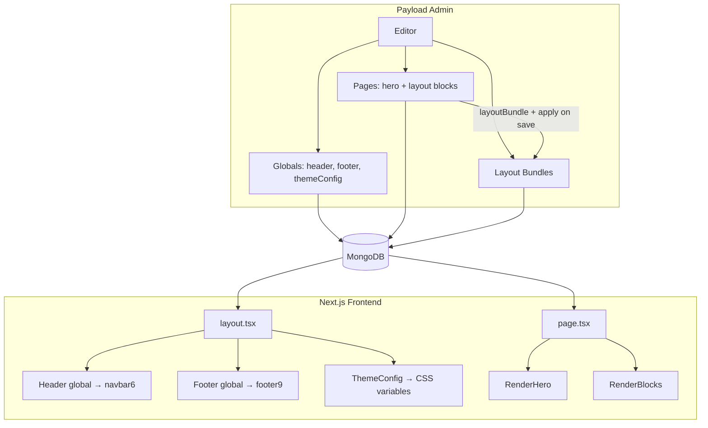

# 04 — Technical architecture

How Orisa integrates into Payblocks: data flow, file layout, globals vs bundles, and seed patterns.

---

## 1. System diagram



**Key rule:** Header and Footer render in `layout.tsx` — outside page `children`. Layout bundles never contain header/footer data.

---

## 2. Data model

### Pages collection

```ts
{
  title: string
  slug: string
  hero: Hero                    // designVersion, headline, media, CTAs, …
  layout: Block[]               // ordered sections — drag-and-drop
  layoutBundle?: relationship   // sidebar — apply trigger only
  applyLayoutBundleMode?: 'none' | 'replace' | 'append' | 'replace-all'
  meta: SEO fields
}
```

Apply hook copies bundle → page on save:

```5:40:src/collections/Pages/hooks/applyLayoutBundle.ts
export const applyLayoutBundle: CollectionBeforeChangeHook = async ({ data, req }) => {
  // clones bundle.layout → data.layout
  // clones bundle.hero → data.hero (when replace-all)
}
```

### Layout bundles collection

```ts
{
  title: string
  slug: string
  category: 'corporate' | 'marketing' | 'landing' | 'custom' | 'orisa'  // add orisa
  description: string
  previewImage?: media
  hero?: Hero
  layout?: Block[]
}
```

### Globals (site shell — one brand)

| Global | Key fields | Orisa |
|--------|------------|-------|
| `themeConfig` | colors, radius, fonts | Orisa coral primary, neutral palette |
| `header` | `designVersion`, logo, items, buttons | `designVersion: '6'` → navbar6 |
| `footer` | `designVersion`, navItems, socialLinks | `designVersion: '9'` → footer9 |

---

## 3. File layout (new files)

```
docs/orisa/                          ← this plan
public/
  admin/previews/orisa/              ← demo screenshots for admin
  seed/orisa/                        ← images copied from theme zip
scripts/
  seed-orisa-globals.ts              ← themeConfig + header + footer preset
  seed-orisa-creative-agency.ts      ← bundle + home page
  seed-orisa-marketing-agency.ts     ← bundle + optional demo page
src/
  globals/
    Header/navbar/navbar6.tsx        ← Orisa megamenu
    Footer/footer/footer9.tsx        ← Orisa dark footer
  heros/
    PageHero/heroOrisaCreative01.tsx
    PageHero/heroOrisaMarketing01.tsx
    metadata.ts                      ← register ORISA_* variants
  blocks/
    OrisaServicesPin/
      config.ts
      Component.tsx
      Component.client.tsx
    OrisaScrollServices/
      config.ts
      Component.tsx
      Component.client.tsx
```

### Registration checklist (every new block)

1. `src/blocks/<Name>/config.ts`
2. `src/collections/Pages/pageBlocks.ts` — add to `PageBlocks` array
3. `src/blocks/blockLoaders.ts` — lazy loader entry
4. `pnpm generate:types`
5. `pnpm generate:importmap`

### Registration checklist (every new hero)

1. Fields + conditions in `src/heros/config.ts`
2. Entry in `src/heros/metadata.ts`
3. Component in `src/heros/PageHero/`
4. Case in `src/heros/RenderHero.tsx`
5. Preview JPEG in `public/admin/previews/hero/`

---

## 4. Frontend rendering

### Root layout (unchanged pattern)

```tsx
// src/app/(frontend)/[[...slugs]]/layout.tsx
<ThemeConfig />      // CSS variables from themeConfig global
<Header />           // reads header global → navbar6
{children}           // page hero + RenderBlocks
<Footer />           // reads footer global → footer9
```

### Page render

```tsx
// Catch-all page
<RenderHero hero={page.hero} />
<RenderBlocks blocks={page.layout} />
```

Header/footer are **not** passed page props — same on every route.

---

## 5. Motion stack

| Effect | Library | Location |
|--------|---------|----------|
| Section fade-in | Framer Motion | `SectionReveal` |
| Scroll pin services | GSAP ScrollTrigger | `OrisaServicesPin`, `OrisaScrollServices` |
| Counters | GSAP or `AnimatedCounter` | Stat / credibility blocks |
| Marquees | CSS animation or existing patterns | `CredibilityStrip`, footer9 |
| Hero text reveal | Framer Motion / GSAP SplitText | Hero components |
| Reduced motion | `useReducedMotion` | All client motion blocks |

**Do not import** Orisa `main.js`, jQuery, or Bootstrap.

---

## 6. Seed script pattern

Follow `scripts/seed-corporate-home.ts`:

```ts
// 1. Load scripts/orisa/asset-manifest.json (from pnpm orisa:sync-assets)
// 2. Upload public/seed/orisa/{shared,creative|marketing}/ to Payload Media
// 2. Build pageData = { title, slug, hero, layout: [...blocks] }
// 3. Upsert pages collection
// 4. Upsert layout-bundles collection (same hero + layout)
// 5. maybeUpdateOrisaGlobals(payload) when --globals
```

### package.json scripts (planned)

```json
{
  "seed:orisa-creative-agency": "payload run scripts/seed-orisa-creative-agency.ts",
  "seed:orisa-creative-agency:globals": "SEED_UPDATE_GLOBALS=1 payload run scripts/seed-orisa-creative-agency.ts",
  "seed:orisa-marketing-agency": "payload run scripts/seed-orisa-marketing-agency.ts",
  "seed:orisa-marketing-agency:globals": "SEED_UPDATE_GLOBALS=1 payload run scripts/seed-orisa-marketing-agency.ts"
}
```

### Globals seed (one brand)

```ts
// scripts/seed-orisa-globals.ts
export async function maybeUpdateOrisaGlobals(payload: Payload) {
  await payload.updateGlobal({ slug: 'themeConfig', data: { /* Orisa tokens */ } })
  await payload.updateGlobal({
    slug: 'header',
    data: { designVersion: '6', items: [...], buttons: [...] },
  })
  await payload.updateGlobal({
    slug: 'footer',
    data: { designVersion: '9', navItems: [...], socialLinks: [...] },
  })
}
```

---

## 7. Editor workflow (technical)

| Action | API / mechanism |
|--------|-----------------|
| Pick bundle | `pages.layoutBundle` relationship |
| Apply bundle | `pages.applyLayoutBundleMode` → `beforeChange` hook |
| Change header style | `header.designVersion` global |
| Change footer style | `footer.designVersion` global |
| Change colors | `themeConfig.regularColors` global |
| Reorder sections | Payload blocks field drag-and-drop |
| Live preview | Existing `livePreview` on Pages + globals |

---

## 8. Styling approach

| Orisa | Payblocks |
|-------|-----------|
| Bootstrap grid | Tailwind `grid`, `flex`, `container` |
| `main.css` classes | Tailwind utilities + CSS variables from ThemeConfig |
| `at-*` BEM classes | Component-scoped Tailwind; no global Orisa CSS import |
| Font Awesome | Lucide + inline SVG from theme |
| `data-bs-theme` | `themeConfig` + optional `ThemeSelector` (light/dark) |

Extract Orisa spacing/color **values** into ThemeConfig — not the CSS file wholesale.

---

## 9. Admin UX improvements (Phase 4)

### Header/footer visual picker

Reuse `designVersionPreview` from heroes:

```17:36:src/components/AdminDashboard/DesignVersionPreview/config.ts
export const designVersionPreview = (options, overrides?) => { ... }
```

Apply to `header.designVersion` and `footer.designVersion` with Orisa preview JPEGs.

### Layout bundle picker

Existing fields:

- `previewImage` on LayoutBundles — upload demo screenshot
- Future: custom relationship field component showing thumbnail grid

---

## 10. Testing

| Test | Command / file |
|------|----------------|
| Typecheck | `pnpm tsc` |
| Lint | `pnpm lint` |
| Seed smoke | Run seed scripts against local MongoDB |
| E2E homepage | `playwright test` — add `e2e/orisa-home.spec.ts` |
| Reduced motion | Manual + `prefers-reduced-motion` in Playwright |
| Bundle apply | Admin: pick bundle → save → verify layout cloned |

---

## 11. What not to build

- Per-page header/footer overrides on Pages collection
- 30 layout bundles for light+dark × 15 demos
- jQuery plugin wrappers
- Full Orisa shop in v1
- Bundling header/footer inside LayoutBundles

---

## 12. Reference: existing patterns to copy

| Pattern | Reference file |
|---------|----------------|
| Custom block + GSAP | `src/blocks/SolutionsShowcase/Component.client.tsx` |
| Team grid block | `src/blocks/TeamGallery/` |
| Corporate hero | `src/heros/PageHero/heroCorp01.tsx` |
| Layout bundle seed | `scripts/seed-corporate-home.ts` |
| Globals seed | `scripts/seed-globals.ts` |
| Header scroll state | `src/hooks/useHeaderScrollState.ts` |
| Navbar variant | `src/globals/Header/navbar/navbar5.tsx` |
| Footer variant | `src/globals/Footer/footer/footer7.tsx` |
