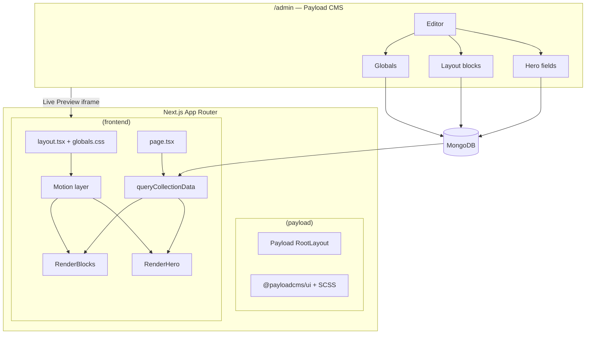

# 04 — Technical architecture

How custom homepage blocks fit into Payblocks: data flow, file layout, motion system, and editor workflow.

---

## 1. System diagram



**Key rule:** Admin never renders shadcn. Frontend never writes to DB except via Payload API/forms.

---

## 2. Data flow (single page load)

1. Request hits `src/app/(frontend)/[[...slugs]]/page.tsx`
2. `queryCollectionData` loads page from MongoDB (draft if preview mode)
3. `RenderHero` maps `hero.designVersion` → `heroCorp01.tsx`
4. `RenderBlocks` maps each `layout[].blockType` → block component
5. Block components read props from CMS JSON; client islands handle motion
6. `Header` / `Footer` / `ThemeConfig` loaded from globals in layout

---

## 3. Directory layout (new files)

```text
docs/roadmap/                          # This roadmap
public/
  admin/previews/hero/hero-corp-01.jpeg
  maps/europe.svg                      # Optional external SVG
src/
  app/(frontend)/[[...slugs]]/
    layout.tsx                         # + SmoothScroll provider
  blocks/
    CredibilityStrip/
      config.ts
      Component.tsx
      Component.client.tsx
    SolutionsShowcase/
      config.ts
      Component.tsx
      Component.client.tsx
    ExpansionMap/
      config.ts
      Component.tsx
      Component.client.tsx
    TeamGallery/
      config.ts
      Component.tsx
      Component.client.tsx
    ClosingCta/                          # Phase 3 optional
      config.ts
      Component.tsx
      Component.client.tsx
  components/
    motion/
      SectionReveal.tsx
      AnimatedCounter.tsx
      motion-tokens.ts
    maps/
      EuropeMap.tsx
    providers/
      SmoothScroll.tsx                 # Lenis wrapper
  heros/
    PageHero/
      heroCorp01.tsx
    config.ts                          # Extended fields
    metadata.ts                          # CORP_01 entry
    RenderHero.tsx                       # Register CORP_01
  hooks/
    useReducedMotion.ts
```

---

## 4. Block implementation pattern

Every custom block follows Payblocks conventions (see [AGENTS.md](../../AGENTS.md)).

### 4.1 Config (`config.ts`)

```ts
import { Block } from 'payload'
import { backgroundColor } from '@/fields/color'
import { link } from '@/fields/link'

export const CredibilityStripBlock: Block = {
  slug: 'credibilityStrip',
  interfaceName: 'CredibilityStripBlock',
  labels: { singular: 'Credibility Strip', plural: 'Credibility Strips' },
  fields: [
    backgroundColor,
    // ... human-readable field labels
  ],
}
```

### 4.2 Server component (`Component.tsx`)

Thin router — keeps RSC boundary clean:

```tsx
import { CredibilityStripClient } from './Component.client'

export const CredibilityStripBlock: React.FC<CredibilityStripBlockProps> = (props) => {
  return <CredibilityStripClient {...props} />
}
```

### 4.3 Client component (`Component.client.tsx`)

Motion, Embla, tabs — `'use client'` only here.

### 4.4 Registration

**`src/collections/Pages/index.ts`:**

```ts
import { CredibilityStripBlock } from '@/blocks/CredibilityStrip/config'

export const PageBlocks: Block[] = [
  CredibilityStripBlock,
  SolutionsShowcaseBlock,
  ExpansionMapBlock,
  TeamGalleryBlock,
  // ... existing blocks
]
```

**`src/blocks/RenderBlocks.tsx`:**

```ts
const blockComponents = {
  credibilityStrip: CredibilityStripBlock,
  solutionsShowcase: SolutionsShowcaseBlock,
  expansionMap: ExpansionMapBlock,
  teamGallery: TeamGalleryBlock,
  // ...
}
```

### 4.5 Tailwind dynamic classes

If blocks use `backgroundColor` enum → `bg-primary`, add cases to `RenderBlocks.tsx` switch (Tailwind v4 static scan requirement).

---

## 5. Hero implementation pattern

Hero is a **page field group**, not a layout block.

| File | Role |
|------|------|
| `src/heros/config.ts` | Field definitions + conditions on `designVersion` |
| `src/heros/metadata.ts` | Preview images for picker |
| `src/heros/PageHero/heroCorp01.tsx` | Render logic |
| `src/heros/RenderHero.tsx` | Switch on `designVersion` |

`heroCorp01.tsx` is a client component if using Framer for headline stagger.

---

## 6. Motion system

### 6.1 Tokens (`src/components/motion/motion-tokens.ts`)

```ts
export const motionTokens = {
  ease: [0.22, 1, 0.36, 1] as const,
  duration: {
    fast: 0.3,
    normal: 0.6,
    slow: 0.9,
  },
  stagger: 0.1,
  viewport: { once: true, margin: '-10%' },
} as const
```

### 6.2 SectionReveal

Wraps each homepage section:

- `initial`: `{ opacity: 0, y: 24 }`
- `whileInView`: `{ opacity: 1, y: 0 }`
- Skips animation when `useReducedMotion()` is true

### 6.3 AnimatedCounter

- Parses numeric portion of `value` string
- Animates from 0 → target over ~1.2s when in view
- Preserves `prefix` / `suffix` (e.g. `+`, `M €`)

### 6.4 Lenis (SmoothScroll provider)

```tsx
'use client'
// Mount in frontend layout Providers
// Respect prefers-reduced-motion: disable Lenis when true
```

### 6.5 Library usage matrix

| Effect | Library | Phase |
|--------|---------|-------|
| Section fade-up | Framer Motion | 1 |
| Hero line stagger | Framer Motion | 1 |
| Counter | Framer Motion | 1 |
| Tab / panel swap | Framer AnimatePresence | 2 |
| Team / mobile solutions carousel | Embla | 2 |
| Smooth scroll | Lenis | 1 |
| Scroll-pin solutions | GSAP ScrollTrigger | 3 |
| Particles hero | magicui / R3F | 3 |

---

## 7. Europe map component

### SVG contract

Each country path/group must have `id` matching ISO alpha-2 lowercase:

```xml
<path id="es" d="..." />
<path id="de" d="..." />
```

### `EuropeMap.tsx` props

```ts
interface EuropeMapProps {
  highlightedCodes: string[]  // from CMS countries[].code
  className?: string
}
```

- Default fill: muted
- Highlighted: `fill-primary` or brand accent
- Optional: hover on country list highlights map region

---

## 8. Embla patterns

### Team gallery (drag free)

```ts
useEmblaCarousel({ dragFree: true, containScroll: 'trimSnaps' })
```

### Solutions (mobile)

```ts
useEmblaCarousel({ align: 'start', loop: false })
```

Show drag hint via CSS `cursor: grab` / `grabbing`.

---

## 9. Localization

All public copy fields: `localized: true`.

| Concern | Approach |
|---------|----------|
| Section anchors | Same `sectionId` all locales (`solutions`) |
| URLs | `/en/`, `/de/` via existing `resolveSlugs` |
| Hero CTA to anchor | Use relative `/#solutions` or locale-prefixed path from `publicContext` |

---

## 10. Live preview

Configured on `Pages` collection (`livePreview.url` + draft autosave 100ms).

Frontend requirements:

- `LivePreviewListener` in layout (already present)
- `draftMode()` in `queryCollectionData` (already present)
- Client components re-render on `router.refresh()` after save

**Test:** Edit headline in admin → preview updates without publish.

---

## 11. Editor workflow

### Homepage edit path

1. `/admin` → Collections → Pages → Home
2. **Hero** tab: lines, video, CTAs
3. **Content** tab: reorder blocks via drag handle
4. **SEO** tab: meta title, description, image
5. Live Preview → verify motion
6. Publish

### Field naming (editor-friendly)

| Avoid | Prefer |
|-------|--------|
| `text1`, `text2` | `headline`, `body`, `intro` |
| `designVersion` only | Keep picker + description in metadata |
| Raw `sectionId` | Default `solutions` + admin description |

### Roles

| Role | Can edit |
|------|----------|
| Editor | Pages, media, posts |
| Admin | + themeConfig, page-config, users, redirects |

---

## 12. Performance notes

| Area | Tactic |
|------|--------|
| Hero video | `poster` for LCP; `preload="metadata"` |
| WebGL | Dynamic `import()`, only Phase 3 |
| Images | Next.js `Image` / existing `Media` component |
| Client JS | One client island per block, not whole page |
| Fonts | Already via layout CSS variables |

---

## 13. Accessibility

| Requirement | Implementation |
|-------------|----------------|
| Reduced motion | `useReducedMotion` + CSS `media (prefers-reduced-motion)` |
| Keyboard | Tabs: roving tabindex; carousel: arrow buttons |
| Focus visible | shadcn focus rings on interactive elements |
| Video | No autoplay sound; decorative → `aria-hidden` |
| Map | Country list duplicated as text; map `aria-label` |

---

## 14. Commands after schema changes

```bash
pnpm generate:types
pnpm generate:importmap
pnpm lint
pnpm tsc
```

If new admin client components:

- Ensure path in `admin.components` or field `admin.components.Field` resolves via import map

---

## 15. Environment

No new required env vars for homepage blocks.

Existing:

| Variable | Role |
|----------|------|
| `MONGODB_URI` | Content storage |
| `NEXT_PUBLIC_SERVER_URL` | Live preview URL |
| `NEXT_PRIVATE_DRAFT_SECRET` | Preview route auth |
| `BLOB_READ_WRITE_TOKEN` | Media uploads |

---

## 16. Relationship to existing Payblocks blocks

| Existing | Homepage role |
|----------|----------------|
| `about`, `stat` | Superseded on home by `credibilityStrip`; keep for inner pages |
| `feature` | Inner Services pages |
| `contact` | `/contact` page |
| `cta` | Homepage closing section (Phase 1) |
| `logos` | Optional inside `expansionMap` partner area |
| `testimonial` | Not used for team — `teamGallery` is purpose-built |
| `MotionText` | Reusable inside Lexical rich areas if needed |
| magicui | Particles, beams for Phase 3 accents |

---

## 17. Type generation

After all blocks added, `src/payload-types.ts` will include:

- `CredibilityStripBlock`
- `SolutionsShowcaseBlock`
- `ExpansionMapBlock`
- `TeamGalleryBlock`
- Extended `Hero` interface with `headlineLines`, `backgroundType`, etc.

Use these types in components — never hand-edit `payload-types.ts`.
